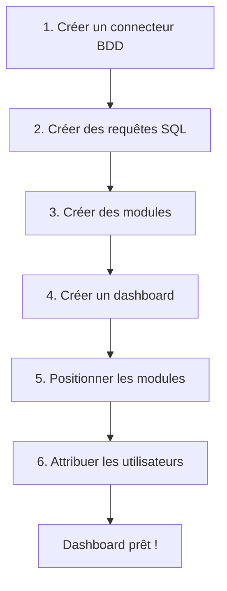

# SYD Builder
{: .fs-9 }

Interface de conception des tableaux de bord
{: .fs-6 .fw-300 }

---

## Présentation

**SYD Builder** est l'interface d'administration destinée aux informaticiens et développeurs. Elle permet de :

- **Configurer les sources de données** : connexions aux bases de données, appels à des webservices
- **Créer des requêtes** : écrire et tester les requêtes SQL qui alimenteront les modules
- **Concevoir des modules** : créer des visualisations (graphiques, tableaux, indicateurs...)
- **Assembler des dashboards** : disposer les modules sur une grille flexible
- **Gérer les accès** : créer des utilisateurs et des groupes, attribuer des permissions
- **Configurer des formulaires** : créer des filtres interactifs pour les dashboards

---

## Menu principal

L'interface Builder propose les sections suivantes dans sa barre de navigation :

| Section | Description |
|:--------|:------------|
| **Dashboards** | Liste et gestion des tableaux de bord |
| **Modules** | Liste et gestion des modules de visualisation |
| **Connecteurs** | Configuration des sources de données |
| **Formulaires** | Création de formulaires de filtrage |
| **Utilisateurs** | Gestion des utilisateurs |
| **Groupes** | Gestion des groupes d'utilisateurs |
| **Catégories** | Organisation des dashboards par catégories |
| **GeoJSON** | Gestion des fichiers de cartographie |
| **Licence** | Informations sur la licence |
| **Paramètres** | Configuration générale |

---

## Workflow de création d'un dashboard

### Étapes détaillées

1. **Connecteur** : Configurez la connexion à votre base de données source
2. **Requêtes** : Écrivez les requêtes SQL qui extrairont les données
3. **Modules** : Créez les visualisations en associant requêtes et types de graphiques
4. **Dashboard** : Créez un nouveau tableau de bord
5. **Layout** : Positionnez et redimensionnez les modules sur la grille
6. **Utilisateurs** : Attribuez les droits d'accès aux utilisateurs concernés

---

## Accès au Builder

L'accès à SYD Builder nécessite une authentification avec un compte disposant des droits d'administration.

{: .warning }
> L'interface Builder ne doit être accessible qu'aux personnes habilitées à concevoir et modifier les tableaux de bord.

